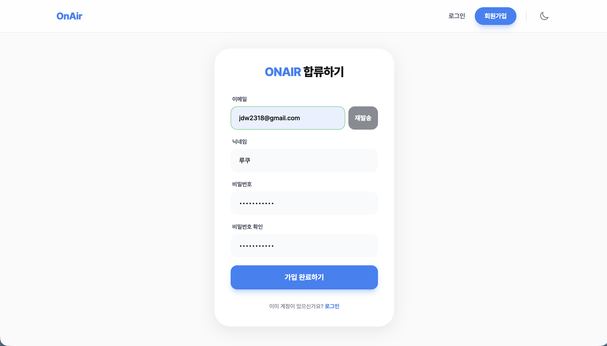
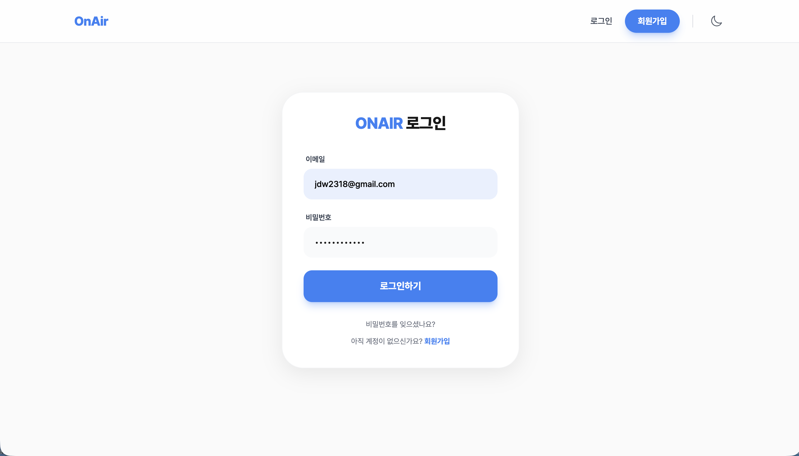
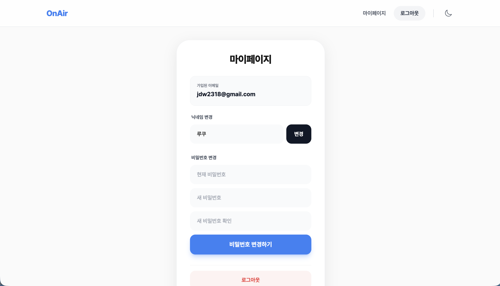
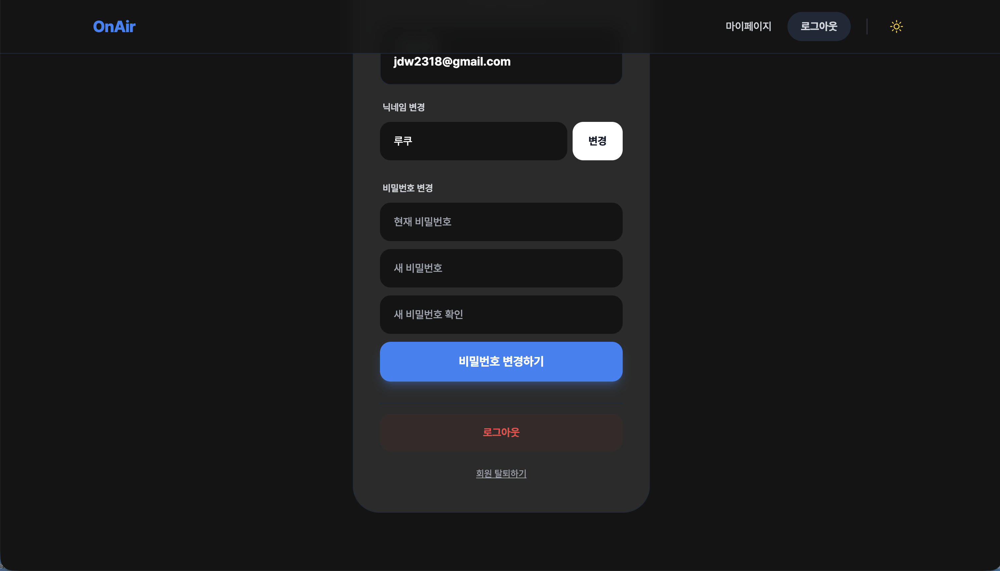
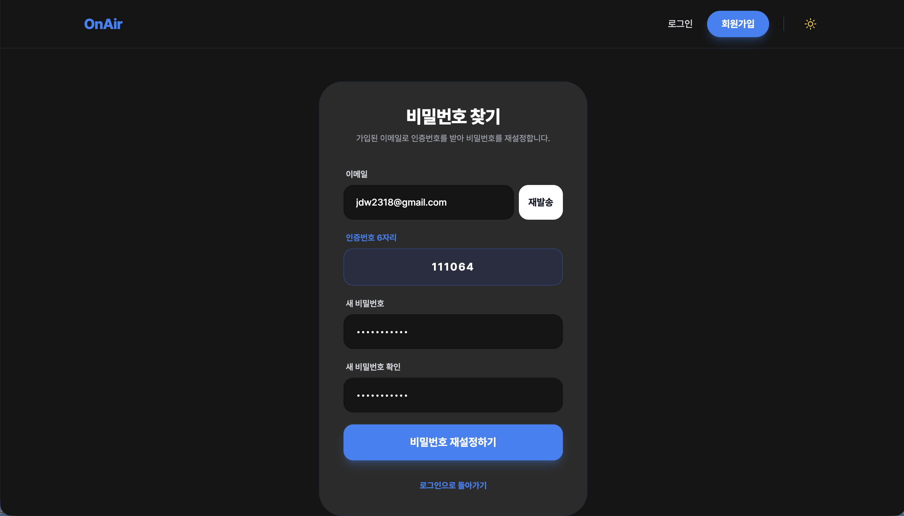

# OnAir - 회원 서비스

Spring Boot 기반의 JWT 인증 회원 서비스입니다. 이메일 인증, 로그인/로그아웃, 마이페이지, 비밀번호 찾기 기능을 제공합니다.

<br>

## 화면

| 메인 (라이트) | 메인 (다크) |
|---|---|
|  |  |

| 회원가입 | 로그인 |
|---|---|
|  |  |

| 마이페이지 (라이트) | 마이페이지 (다크) |
|---|---|
|  |  |

| 비밀번호 찾기 |
|---|
|  |

<br>

## 기술 스택

**백엔드**
- Java 17, Spring Boot 3
- Spring Security + JWT
- Redis (이메일 인증번호 관리)
- MySQL, Spring Data JPA
- Lombok

**프론트엔드**
- React, Vite
- Tailwind CSS
- Axios

<br>

## 주요 기능

- **회원가입** — 이메일 인증번호 발송 및 검증 후 가입 완료
- **로그인** — JWT 토큰 발급 및 로컬 스토리지 저장
- **마이페이지** — 닉네임 변경, 비밀번호 변경, 회원 탈퇴
- **비밀번호 찾기** — 이메일 인증번호로 비밀번호 재설정
- **다크모드** — 라이트/다크 테마 전환

<br>

## 프로젝트 구조

```
member-service/
├── src/
│   └── main/java/com/example/member_service/
│       ├── config/          # Security, CORS 설정
│       ├── controller/      # API 엔드포인트
│       ├── dto/             # 요청/응답 DTO
│       ├── entity/          # JPA 엔티티
│       ├── exception/       # 전역 예외 처리
│       ├── jwt/             # JWT 생성 및 필터
│       ├── repository/      # JPA Repository
│       └── service/         # 비즈니스 로직
└── member-frontend/
    └── src/
        ├── api/             # Axios API 함수
        ├── components/      # 공통 컴포넌트 (Header)
        └── pages/           # 페이지 컴포넌트
```

<br>

## 환경 변수

백엔드 실행 전 아래 환경 변수를 설정해야 합니다.

```
DB_PASSWORD=데이터베이스_비밀번호
JWT_SECRET_KEY=JWT_시크릿_키
MAIL_USERNAME=메일_계정
MAIL_PASSWORD=메일_비밀번호
```

<br>

## 실행 방법

**백엔드**
```bash
./gradlew bootRun
```

**프론트엔드**
```bash
cd member-frontend
npm install
npm run dev
```

> 백엔드: `http://localhost:8080`  
> 프론트엔드: `http://localhost:5173`

<br>

## API 명세

| 메서드 | 경로 | 설명 | 인증 필요 |
|---|---|---|---|
| POST | `/api/members/signup` | 회원가입 | X |
| POST | `/api/members/signup/code` | 회원가입 이메일 인증번호 발송 | X |
| POST | `/api/members/signup/verify` | 인증번호 확인 | X |
| POST | `/api/members/login` | 로그인 (JWT 발급) | X |
| GET | `/api/members/me` | 내 정보 조회 | O |
| PUT | `/api/members/me/nickname` | 닉네임 변경 | O |
| PUT | `/api/members/me/password` | 비밀번호 변경 | O |
| DELETE | `/api/members/me` | 회원 탈퇴 | O |
| POST | `/api/members/password/code` | 비밀번호 찾기 인증번호 발송 | X |
| POST | `/api/members/password/reset` | 비밀번호 재설정 | X |

<br>

## 기술적 의사결정

**Redis로 이메일 인증번호 관리**
인증번호는 10분 유효시간이 지나면 자동 삭제되어야 합니다. DB에 저장하면 만료된 데이터를 지우는 별도 스케줄러가 필요하지만, Redis의 TTL 기능을 사용하면 만료 시 자동으로 삭제되어 별도 처리가 필요 없습니다.

**Stateless JWT 인증**
세션 방식은 서버에 상태를 저장해야 하므로 서버가 늘어날 때 세션 공유 문제가 생깁니다. JWT는 토큰 자체에 정보를 담아 서버가 상태를 저장하지 않아도 되므로 확장성이 좋습니다.

**BCrypt 비밀번호 암호화**
BCrypt는 같은 비밀번호라도 매번 다른 해시값을 생성하고(Salt 내장), 연산 비용을 조절할 수 있어 Rainbow Table 공격에 강합니다.

<br>

## 개발 노트

- 백엔드: 직접 설계 및 구현
- 프론트엔드: Claude Code 활용 (버그 수정, 리팩토링, 비밀번호 찾기 페이지 추가)
